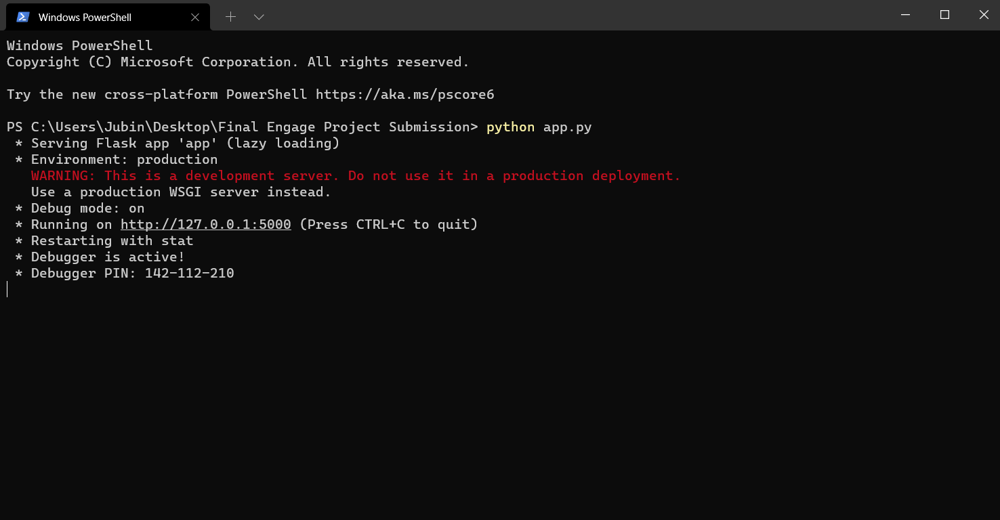
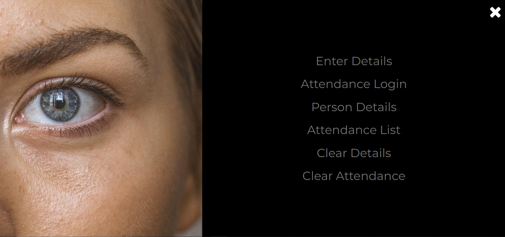
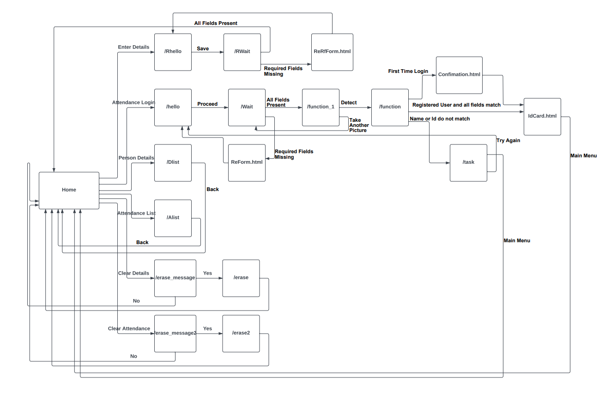

# Microsoft-Engage-2022-Project
## Project Made by Jubin Banerjee
### Email id : jb170503@gmail.com
### Mobile Number : 9106172136

## Challenge 1 : Face Recognition

Please use `python version 3.7.7` for better usage of the program and run it on Windows

## Prerequisites :
Clone the repository using :
```bash
# with git bash or windows terminal:
git clone https://github.com/Ichigo1705/Microsoft-Engage-2022-Project.git
```
Install the requirements in the folder using :
```bash
# with pip:
pip install -r requirements.txt
```

Run the `app.py` file present in the cloned folder:
```bash
# with python:
python app.py
```

Start the localhost by `ctrl+click`:


We will see the `HOME page` on localhost as:


### On the top right corner we see the index button, Pressing it reveals 6 options: 
1. Enter Details
2. Attendance Login
3. Person Details
4. Attendance List
5. Clear Details
6. Clear Attendance



## Enter Details : Feature to be used by the admin for entering details of users
## Attendance Login : Feature to be used by the user for log in using Face Recognition
## Person Details : Feature which shows all the details of the registered user
## Attendance list : Feature which shows the attendance of the users. It only stores the first attendance of a user and does not repeat the same name
## Clear Details : Feature which clears the database of the registered users
## Clear Attendance : Feature which clears the attendance list

**I have used the facenet-pytorch package for face detection and face recognition in my project.
Further details regarding this can be found in this [link](https://github.com/Ichigo1705/facenet-pytorch)**

**For the gender and age-group detection I have used the models trained by Tal Hassner and Gil Levi in opencv-python.
Further details regarding this can be found in this [link](https://github.com/Ichigo1705/Gender-and-Age-Detection)**

# This is the Web flow diagram of the app


# Note
For proper functioning of the program, please ensure that the user is sat in a well lighted area for a clear webcam picture and only one user at a time sits in front of the webcam.

Also the images uploaded in the database should be solo images of only the registered user and not group images
