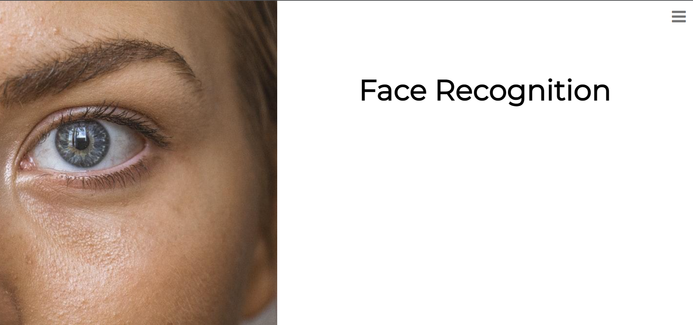

# Microsoft-Engage-2022-Project
## Project Made by Jubin Banerjee
### Email id : jb170503@gmail.com
### Mobile Number : 9106172136

## Challenge 1 : Face Recognition

Please use `python version 3.7.7` for better usage of the program and run it on Windows

## Prerequisites :
Clone the repository using `git clone https://github.com/Ichigo1705/Microsoft-Engage-2022-Project.git` in git bash or windows terminal
Install the requirements in the folder using :
```bash
# with pip:
pip install -r requirements.txt
```

Run the `app.py` file present in the cloned folder:
```bash
# with python:
python app.py
```

Start the localhost by `ctrl+click`:


We will see the `HOME page` on localhost as:


### On the top right corner we see the index button, Pressing it reveals 6 options: 
1. Enter Details
2. Attendance Login
3. Person Details
4. Attendance List
5. Clear Details
6. Clear Attendance


